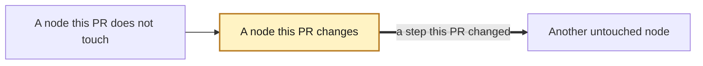
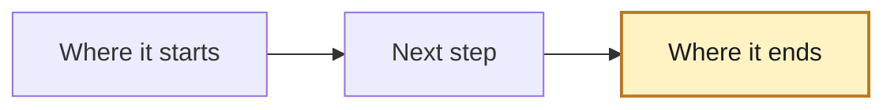
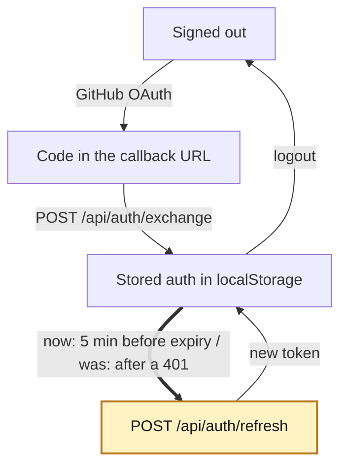

# Lifecycle graphs

How to draw the **Lifecycle** section of the [pull request template](./pull_request_template.md).

The point of the section is one picture of the thing your change makes move, with the
part you moved marked. A reviewer should be able to look at it for five seconds and
know where to start reading.

## The two marks

A change shows up in a lifecycle graph in one of two ways, so there are two marks.

| What your PR changed | How to mark it |
| --- | --- |
| A node — a state, a step, a store | put `:::changed` after the node |
| A transition between two nodes that both stayed the same | draw it with a thick arrow, `==>`, and label it with what changed |

They are marked differently because Mermaid can attach a class to a node but not to
an arrow. Thickness is the one arrow style that survives editing (see
[Do not use `linkStyle`](#do-not-use-linkstyle) below).



## Start from this

Paste this into the Lifecycle section and edit it. Keep the `classDef` line — it is
what makes `:::changed` visible.

````text

````

Use `flowchart`. `flowchart TD` (top down) suits a state machine; `flowchart LR`
(left to right) suits a pipeline.

## A worked example

Say a PR moves the token refresh so it runs shortly before the token expires,
instead of after a request comes back with a 401. Nothing else about signing in
changes. The refresh node changes, and so does the arrow that leads into it:



Two things that example gets right, and that are easy to get wrong:

- It draws **what the token does**, not which files were edited. A graph of the file
  tree tells the reviewer nothing the diff does not already say.
- The marked arrow is labelled with the old behaviour and the new one. A thick arrow
  with no label only says "something here moved", which sends the reviewer hunting.

## Rules that keep it useful

- **Keep it small.** Aim for ten nodes or fewer. If the graph needs more, the PR is
  probably worth splitting, or worth drawing at a higher level.
- **Mark only what this PR moves.** If everything is marked, nothing is.
- **Draw one lifecycle.** If your change touches two unrelated ones, use two graphs.
- **Write states, not verbs, in nodes.** `Queued`, `Stored auth`, `Merged` — the verbs
  belong on the arrows.
- **Put `classDef` last**, after the nodes and arrows. It reads as a footnote and it is
  easy to spot when someone forgets it.

## Traps

Each of these renders without an error message, so nothing tells you it went wrong.

### `:::changed` does nothing without `classDef`

A node marked `:::changed` in a graph with no `classDef changed ...` line renders as
an ordinary node. There is no warning. If your marked node looks like all the others,
this is why.

### Use `flowchart`, not `stateDiagram-v2`

Thick arrows do not exist in `stateDiagram-v2`. Mermaid reads `B ==> C` there as a
state *named* `==>`, and draws a stray box between B and C. It does not complain.
`flowchart` supports both marks, so use it.

### Do not use `linkStyle`

`linkStyle 3 stroke:#b7791f` picks an arrow by counting arrows in the order they are
written, starting at 0. Add an arrow anywhere above it and the styling silently moves
to a different arrow. The thick `==>` arrow is attached to the arrow itself, so it
cannot drift.

### Colours have to work in both themes

GitHub renders the graph on a light or a dark page, depending on the reader's theme.
The `classDef` above sets `fill`, `stroke` and `color` together, so the marked node
stays readable either way. If you change the colours, set all three.

## When to delete the section

Delete it when the change is local and nothing about its lifecycle moves — a bug fix
inside one function, a rename, a copy change, a new test. A graph of a lifecycle that
did not move costs the reviewer time and tells them nothing.
