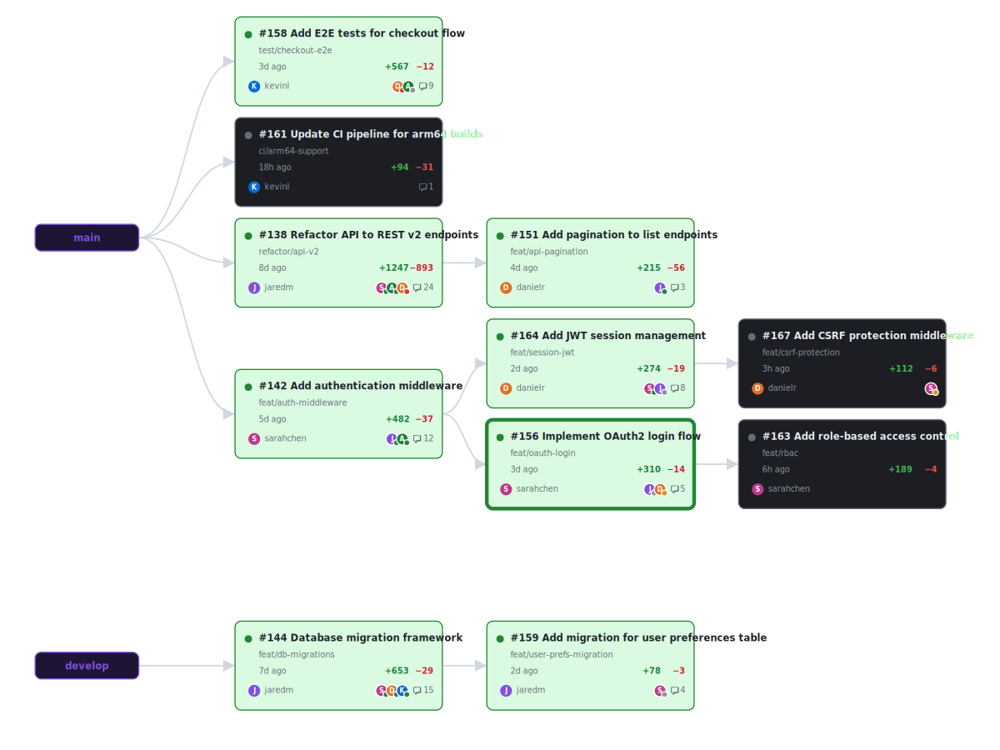

# PR Dependency Graph

A containerized Node.js + React application that visualizes pull request dependency graphs for GitHub repositories. It detects stacked PRs (where one PR's base branch is another PR's head branch) and renders an interactive D3.js directed acyclic graph.



## Quick Start

```bash
# Set your GitHub token (option A: environment variable)
export GITHUB_TOKEN=ghp_your_token_here

# Or store it in a .env file (option B)
echo "GITHUB_TOKEN=ghp_your_token_here" > .env

# Run with Docker Compose
docker compose up

# Open http://localhost:8000
```

## How It Works

1. Enter a GitHub `owner/repo` on the landing page.
2. The server fetches all open PRs via the GitHub API.
3. Stacked PR dependencies are detected: if PR-B's base branch matches PR-A's head branch, PR-B depends on PR-A.
4. The React frontend renders an interactive force-directed graph with clickable PR nodes.
