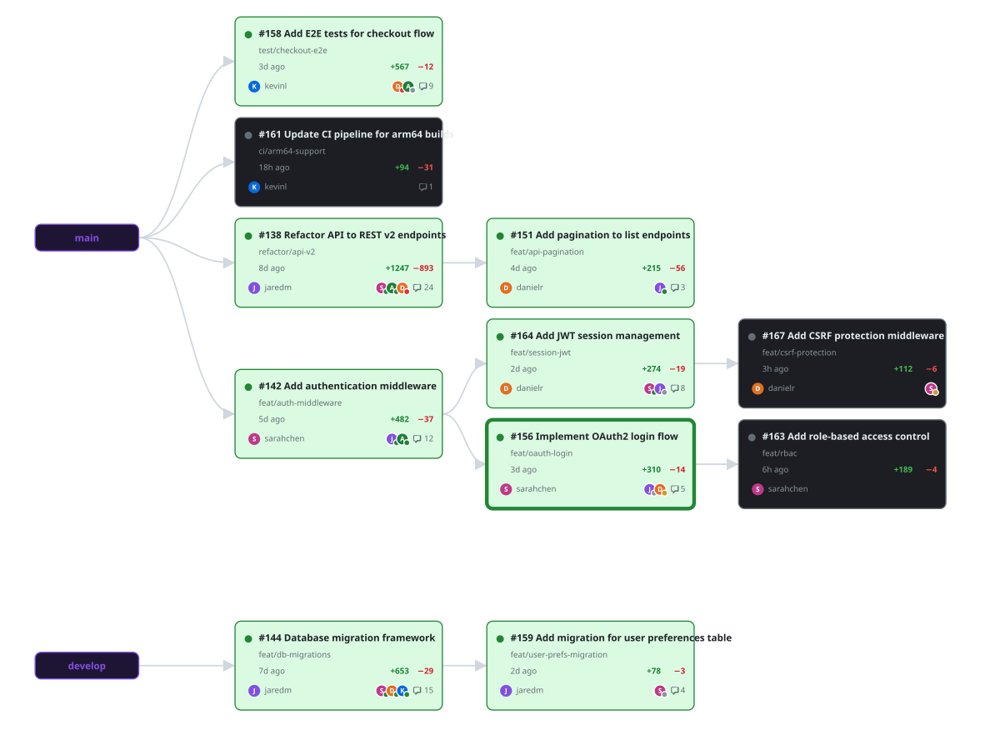

# PR Dependency Graph

A React application that visualizes pull request dependency graphs for GitHub repositories. It detects stacked PRs (where one PR's base branch is another PR's head branch) and renders an interactive D3.js directed acyclic graph.



## Quick Start

### Docker

```bash
docker compose up
# Open http://localhost:8000
```

### Bash

```bash
cd client
npm install
npm run dev
# Open http://localhost:5173
```

Go to your browser, sign in with GitHub (or paste a personal access token in the Advanced section), then enter a repository in `owner/repo` format.

## How It Works

1. Sign in with GitHub via the OAuth App web flow (or paste a personal access token under "Advanced").
2. Enter a GitHub `owner/repo`.
3. The app fetches all open PRs directly from the GitHub GraphQL API.
4. Stacked PR dependencies are detected: if PR-B's base branch matches PR-A's head branch, PR-B depends on PR-A.
5. PRs belonging to a native GitHub stack also carry their stack membership, read from the `stack` and `stackEntry` fields on the GraphQL `PullRequest` type. A stack badge on the card shows the PR's layer, e.g. `2/3`. GitHub rejects the update-branch endpoint for a stacked PR — a stack is rebased as a whole, and only the PR's own "Rebase Stack" button or `gh stack rebase` can ask for that — so the update badge opens the pull request instead. Repositories without GitHub's stacked pull requests are unaffected: the fields are dropped from the query and the branch heuristic above still applies.
6. An interactive force-directed graph is rendered with clickable PR nodes.

## Sharing a Stack of PRs

Every pull request card carries an eye badge that focuses the graph on that PR
and the PRs stacked on top of it: the stack is framed and the rest of the graph
fades back, and the page address becomes `https://<host>/owner/repo?pr=123`.
The banner above the graph names the focused PR, offers to copy that link so it
can be shared, and leads back to the full view. Opening the link elsewhere
reproduces the same focused view.

The same view can be reached without a link: paste a pull request URL
(`https://github.com/owner/repo/pull/123`) or type `owner/repo#123` into the
repository box on the home page.

Links are deliberately free of filters, so the recipient sees the stack rather
than the sharer's filtered view. If the focused PR was opened before the
reader's default date range, the range is widened to the day it was opened so
the stack still loads; a PR that is closed, filtered out or nonexistent is
reported in the banner instead.
